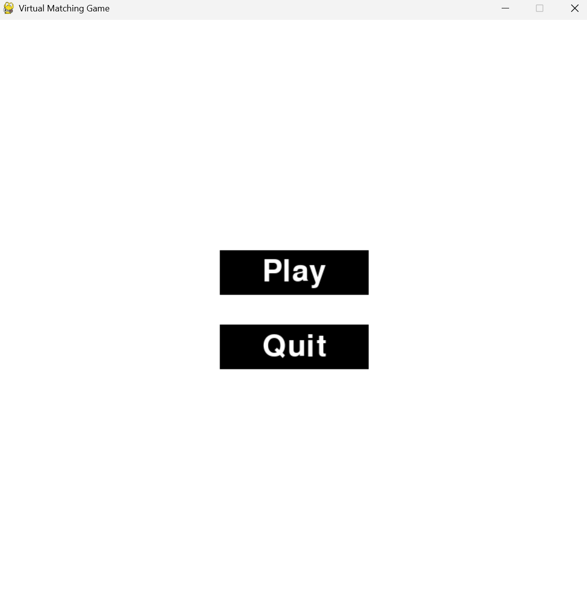
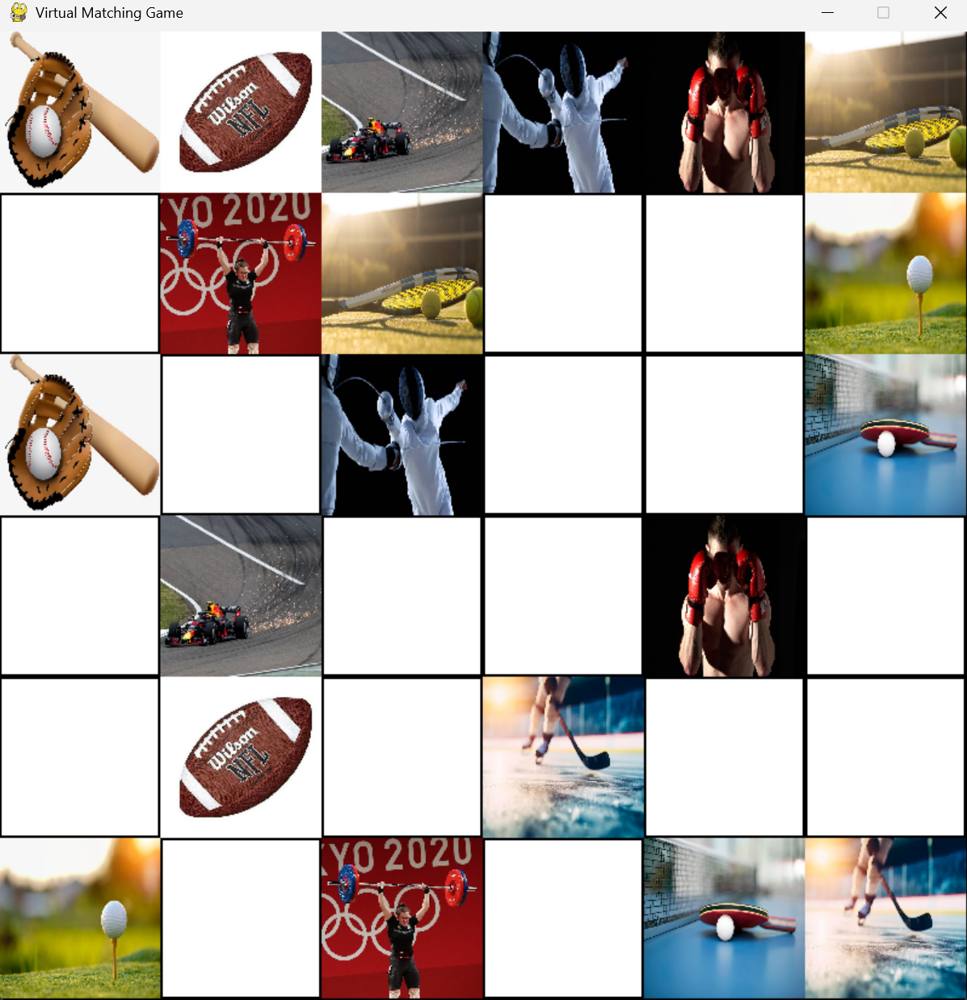

# Virtual Matching Game

A sports-themed virtual memory game where players match pairs of cards on a 6x6 grid, designed to enhance memory and cognitive skills.

## Features
- Interactive 6x6 grid with randomized sports-themed images.
- User-friendly interface and gameplay.
- Victory message upon matching all pairs.

## How to Play
1. Launch the game by running the script.
2. Click "Play" on the start screen to begin.
3. Flip cards by clicking on them to find matching pairs.
4. Match all pairs to win the game!

### Start Screen

### Gameplay Example

